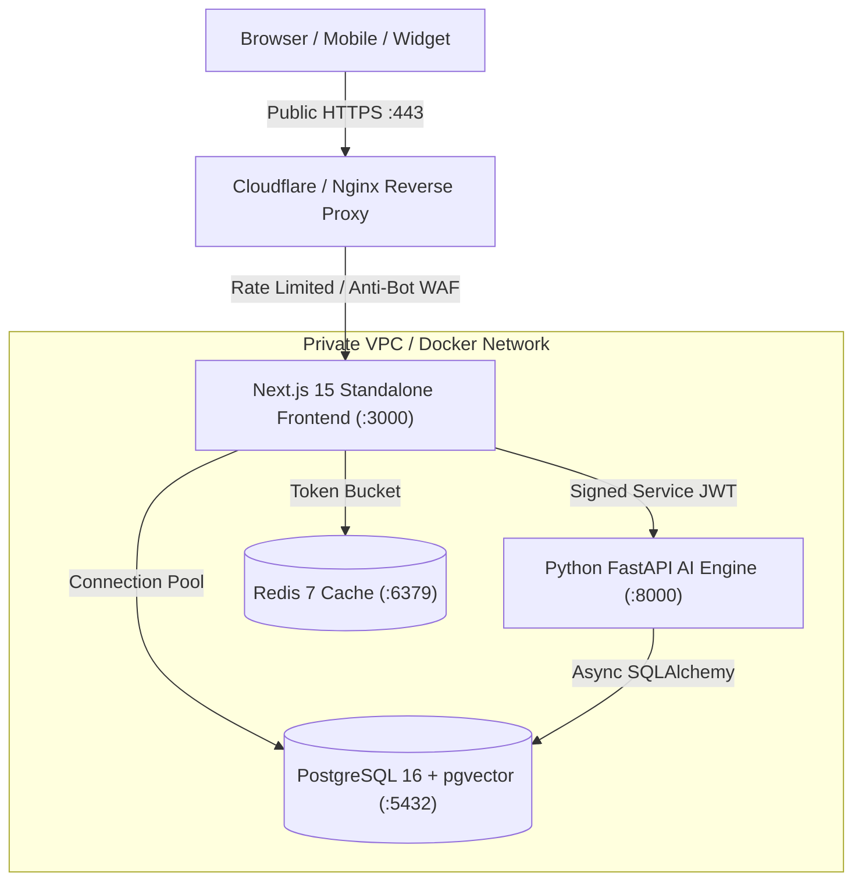

# 🚀 ShopMate AaaS — Production Launch Checklist & Security Audit

This document defines the strict pre-launch verification requirements, environment configuration, security architecture, and residual risk assessment for deploying the ShopMate Multi-Tenant AI Agent Platform.

---

## 1. Pre-Launch Verification Matrix

| Category | Verification Test | Status | Command |
| :--- | :--- | :---: | :--- |
| **Fail-Closed Secrets** | Boot-time validation in Node (`instrumentation.ts`) & Python (`app/auth.py`) | ✅ PASSED | `npm run test:acceptance` |
| **Strict Type Checking** | TypeScript Zero-Error Strict Compilation | ✅ PASSED | `npx tsc --noEmit` |
| **Code Style & Lints** | ESLint with strict rules & zero build bypasses | ✅ PASSED | `npm run lint` |
| **Production Build** | Next.js 15 Standalone Optimized Build (62/62 routes) | ✅ PASSED | `npm run build` |
| **Core Integration** | Authentication, 128-dim RAG, Tools & Evals | ✅ PASSED | `npm run test:integration` |
| **Acceptance Suite** | 30/30 Production Hardening & Security Criteria | ✅ PASSED | `npm run test:acceptance` |
| **Security & SSRF** | SSRF Blocking, Rate Limiting, RBAC & Entailment | ✅ PASSED | `npx tsx scripts/test-security.ts` |
| **Python HTTP Security** | HTTP 401/403/404/429 & Cross-Tenant Boundary Tests | ✅ PASSED | `python python-backend/test_http_endpoints.py` |
| **Python Agent Pipeline** | Multi-Tenant 12-Stage RAG & Multi-Step Runtime | ✅ PASSED | `python python-backend/test_pipeline.py` |
| **AI Evaluation Harness** | 24/24 Realistic Customer Test Cases (100.0% Pass) | ✅ PASSED | `python python-backend/test_evals.py` |
| **Enterprise DB Isolation**| 6/6 SQL Relational & Vector Storage Suites | ✅ PASSED | `python python-backend/test_db.py` |
| **Massive Multi-Tenancy** | 10 Concurrent Tenant Isolation & Vector Partitioning | ✅ PASSED | `python python-backend/test_massive_multitenancy.py` |

---

## 2. Environment Variables Matrix

### Next.js Service
| Variable | Required | Default / Description |
| :--- | :---: | :--- |
| `NODE_ENV` | **Yes** | `production` |
| `APP_ENV` | **Yes** | `production` (or `development` for local testing) |
| `DATABASE_PATH` | Optional | Path to JSON/SQLite storage (`data/aaas.db.json`) |
| `SESSION_JWT_SECRET` | **Yes** | 32+ byte cryptographic secret for end-user app sessions |
| `SERVICE_JWT_SECRET` | **Yes** | 32+ byte cryptographic secret for service-to-service auth with Python |
| `STRIPE_SECRET_KEY` | Optional | Stripe Live Secret Key (`sk_live_...`) |
| `STRIPE_WEBHOOK_SECRET` | Optional | Stripe Webhook HMAC secret (`whsec_...`) |
| `RAZORPAY_KEY_ID` | Optional | Razorpay Merchant Key ID (`rzp_live_...`) |
| `RAZORPAY_KEY_SECRET` | Optional | Razorpay Merchant Key Secret |
| `RAZORPAY_WEBHOOK_SECRET` | Optional | Razorpay Webhook HMAC secret |
| `RESEND_API_KEY` | Optional | Resend API Key for transactional emails |
| `EMAIL_FROM` | Optional | From email header for transactional notifications |
| `TURNSTILE_SECRET_KEY` | Optional | Cloudflare Turnstile anti-bot secret key |
| `HCAPTCHA_SECRET_KEY` | Optional | hCaptcha anti-bot secret key |

### Python AI & RAG Backend Service
| Variable | Required | Default / Description |
| :--- | :---: | :--- |
| `APP_ENV` | **Yes** | `production` (or `development` for local testing) |
| `DATABASE_URL` | **Yes** | Async PostgreSQL connection string (`postgresql+asyncpg://...`) |
| `SERVICE_JWT_SECRET` | **Yes** | Must match Next.js `SERVICE_JWT_SECRET` for signed service-to-service auth |
| `ALLOWED_ORIGINS` | **Yes** | Comma-separated list of allowed origins (e.g. `http://localhost:3000`) |
| `LLM_PROVIDER` | Optional | `openai`, `anthropic`, `ollama` |
| `LLM_MODEL` | Optional | Model identifier override (e.g. `gpt-4o`, `claude-3-5-sonnet`) |
| `OPENAI_API_KEY` | Optional | OpenAI API key for `text-embedding-3-small` and `gpt-4o` |
| `ANTHROPIC_API_KEY` | Optional | Anthropic API key for `claude-3-5-sonnet` |
| `OLLAMA_BASE_URL` | Optional | Local Ollama endpoint (`http://localhost:11434`) |

---

## 3. Production Deployment & Security Topology

### Key Security Guardrails:
1. **Fail-Closed Secret Validation**: Both services refuse to start if secrets are missing, shorter than 32 bytes, or set to insecure default strings. Development fallbacks require explicit `APP_ENV=development`.
2. **Zero Anonymous Access**: Anonymous requests in any environment never authenticate or fall back to arbitrary tenant data.
3. **No Order Enumeration**: Order lookup requires matching customer email; mismatched/unknown orders return an identical generic response.
4. **SSRF Guard (`safeFetch`)**: Resolves DNS, checks all IP aliases against private/loopback/cloud metadata ranges, re-validates each redirect hop, and enforces maximum response size limits.
5. **Prompt Injection Defense (`<<<UNTRUSTED_CATALOG_DATA>>>`)**: Untrusted data blocks cannot trigger tool execution or prompt overrides.
6. **Server-Side Computed Arithmetic & Quota Limits**: Carts, prices, discounts, and quotas (402 Payment Required) are strictly computed server-side.
